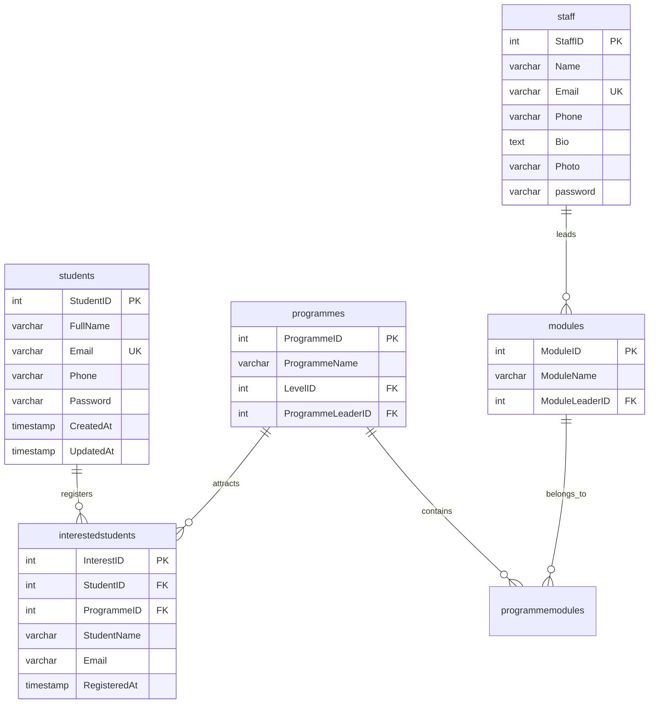

# Design Document: Staff & Student Portal Enhancement

**Feature Name:** Staff & Student Portal Enhancement  
**Spec Type:** Feature Enhancement  
**Created:** 2026-03-23  
**Status:** Draft

---

## 1. Overview

### 1.1 Purpose
This design document specifies the technical implementation for enhancing the existing staff portal and creating a new student portal. The enhancement enables staff self-service profile management and interest tracking, while providing students with account registration, authentication, and programme interest management capabilities.

### 1.2 Scope
The implementation includes:
- Staff profile self-service (name, email, phone, photo, password)
- Staff interested students tracking with filtering and CSV export
- Complete student portal (registration, authentication, dashboard, profile management)
- Database schema enhancements (new students table, modified interestedstudents table)
- Separate authentication systems for students vs staff/admin
- Security implementations (password hashing, session management, CSRF protection)

### 1.3 Design Goals
- Maintain consistency with existing system architecture and UI patterns
- Ensure security through proper authentication, authorization, and input validation
- Provide intuitive self-service capabilities to reduce administrative overhead
- Maintain WCAG 2.1 AA accessibility compliance
- Use existing tech stack: PHP 7.4+, MySQL, vanilla JavaScript, custom CSS

### 1.4 Key Constraints
- No external frameworks or libraries allowed
- Must maintain backward compatibility with existing admin and staff functionality
- Must use existing database connection and session management patterns
- File uploads must use existing uploads directory structure

---

## 2. Architecture

### 2.1 System Architecture

The system follows a traditional three-tier architecture:

```
┌─────────────────────────────────────────────────────────────┐
│                     Presentation Layer                       │
│  ┌──────────────┐  ┌──────────────┐  ┌──────────────┐      │
│  │   Public     │  │    Staff     │  │   Student    │      │
│  │   Pages      │  │   Portal     │  │   Portal     │      │
│  └──────────────┘  └──────────────┘  └──────────────┘      │
└─────────────────────────────────────────────────────────────┘
                            │
┌─────────────────────────────────────────────────────────────┐
│                     Application Layer                        │
│  ┌──────────────────────────────────────────────────────┐   │
│  │  Session Management & Authentication                  │   │
│  │  - Admin Sessions ($_SESSION['admin'])               │   │
│  │  - Staff Sessions ($_SESSION['staff'])               │   │
│  │  - Student Sessions ($_SESSION['student'])           │   │
│  └──────────────────────────────────────────────────────┘   │
│  ┌──────────────────────────────────────────────────────┐   │
│  │  Business Logic                                       │   │
│  │  - Profile Management                                 │   │
│  │  - Interest Tracking                                  │   │
│  │  - File Upload Handling                               │   │
│  │  - CSV Export Generation                              │   │
│  └──────────────────────────────────────────────────────┘   │
└─────────────────────────────────────────────────────────────┘
                            │
┌─────────────────────────────────────────────────────────────┐
│                       Data Layer                             │
│  ┌──────────────────────────────────────────────────────┐   │
│  │  MySQL Database (PDO)                                 │   │
│  │  - admin, staff, students tables                      │   │
│  │  - programmes, modules, levels tables                 │   │
│  │  - interestedstudents, programmemodules tables        │   │
│  └──────────────────────────────────────────────────────┘   │
│  ┌──────────────────────────────────────────────────────┐   │
│  │  File System                                          │   │
│  │  - uploads/staff/ (staff photos)                      │   │
│  │  - uploads/programme_* (programme images)             │   │
│  └──────────────────────────────────────────────────────┘   │
└─────────────────────────────────────────────────────────────┘
```

### 2.2 Authentication Flow

```mermaid
graph TD
    A[User Access] --> B{User Type?}
    B -->|Admin| C[admin/login.php]
    B -->|Staff| D[staff/login.php]
    B -->|Student| E[students/login.php]
    
    C --> F{Valid Credentials?}
    D --> G{Valid Credentials?}
    E --> H{Valid Credentials?}
    
    F -->|Yes| I[Set $_SESSION['admin']]
    G -->|Yes| J[Set $_SESSION['staff']]
    H -->|Yes| K[Set $_SESSION['student']]
    
    F -->|No| L[Show Error]
    G -->|No| L
    H -->|No| L
    
    I --> M[admin/dashboard.php]
    J --> N[staff/dashboard.php]
    K --> O[students/dashboard.php]
```

### 2.3 Directory Structure

```
project_root/
├── admin/                      # Existing admin portal
│   ├── dashboard.php
│   ├── admin_settings.php
│   ├── manage_staff.php
│   └── ...
├── staff/                      # Enhanced staff portal
│   ├── dashboard.php          # Existing
│   ├── login.php              # Existing
│   ├── logout.php             # Existing
│   ├── settings.php           # NEW - Profile management
│   └── interested_students.php # NEW - View interested students
├── students/                   # NEW - Student portal
│   ├── register.php           # NEW - Student registration
│   ├── login.php              # NEW - Student login
│   ├── logout.php             # NEW - Student logout
│   ├── dashboard.php          # NEW - Student dashboard
│   └── settings.php           # NEW - Student profile settings
├── public/                     # Public-facing pages
│   ├── index.php
│   ├── programme.php
│   ├── register_interest.php  # MODIFIED - Check student login
│   └── ...
├── includes/                   # Shared components
│   ├── header.php             # MODIFIED - Add student login link
│   ├── admin_header.php
│   ├── footer.php
│   └── admin_footer.php
├── config/
│   └── db.php                 # Database connection
├── css/
│   └── university.css         # Existing styles
└── uploads/
    └── staff/                 # Staff photo uploads
```

---

## 3. Components and Interfaces

### 3.1 Staff Portal Components

#### 3.1.1 Staff Settings Page (`staff/settings.php`)

**Purpose:** Allow staff to manage their own profile information

**Features:**
- Update name, email, phone number
- Upload/change profile photo
- Change password
- View current profile information

**Access Control:**
- Requires `$_SESSION['staff']` to be set
- Staff can only edit their own profile (StaffID from session)

**Form Handling:**
- Profile update form (POST with `_action=update_profile`)
- Photo upload form (POST with `_action=update_photo`)
- Password change form (POST with `_action=change_password`)

**Validation:**
- Name: 2-100 characters, required
- Email: Valid email format, unique in staff table, required
- Phone: Optional, 10-20 characters, digits and separators only
- Photo: JPG/PNG/GIF/WebP, max 5MB
- Password: Minimum 8 characters, requires current password verification

#### 3.1.2 Staff Interested Students Page (`staff/interested_students.php`)

**Purpose:** Display students interested in programmes containing staff's modules

**Features:**
- List all interested students for staff's teaching areas
- Filter by specific programme
- Export to CSV
- Display count of interested students
- Pagination for large datasets

**Access Control:**
- Requires `$_SESSION['staff']` to be set
- Only shows students interested in programmes containing modules led by the logged-in staff member

**Query Logic:**
```sql
SELECT DISTINCT 
    is.StudentName, 
    is.Email, 
    p.ProgrammeName, 
    is.RegisteredAt
FROM interestedstudents is
JOIN programmes p ON is.ProgrammeID = p.ProgrammeID
JOIN programmemodules pm ON p.ProgrammeID = pm.ProgrammeID
JOIN modules m ON pm.ModuleID = m.ModuleID
WHERE m.ModuleLeaderID = ?
ORDER BY is.RegisteredAt DESC
```

**CSV Export:**
- Filename: `interested_students_YYYY-MM-DD.csv`
- Headers: Name, Email, Programme, Registration Date
- Respects current filter selection

### 3.2 Student Portal Components

#### 3.2.1 Student Registration Page (`students/register.php`)

**Purpose:** Allow prospective students to create accounts

**Features:**
- Registration form with name, email, phone (optional), password
- Email uniqueness validation
- Password confirmation
- Automatic login after successful registration
- Link to login page for existing users

**Form Fields:**
- FullName (VARCHAR(100), required)
- Email (VARCHAR(150), required, unique)
- Phone (VARCHAR(20), optional)
- Password (minimum 8 characters, required)
- ConfirmPassword (must match Password)

**Validation:**
- Email format validation using `filter_var(FILTER_VALIDATE_EMAIL)`
- Email uniqueness check against students table
- Password length minimum 8 characters
- Password confirmation match
- Name length 2-100 characters

**Post-Registration:**
- Hash password using `password_hash()`
- Insert into students table
- Set `$_SESSION['student']` with StudentID, FullName, Email
- Redirect to `students/dashboard.php`

#### 3.2.2 Student Login Page (`students/login.php`)

**Purpose:** Authenticate registered students

**Features:**
- Login form with email and password
- Error messages for invalid credentials
- Link to registration page
- Link back to public site

**Authentication Flow:**
1. Validate email and password are provided
2. Query students table for matching email
3. Verify password using `password_verify()`
4. On success: Set `$_SESSION['student']` and redirect to dashboard
5. On failure: Display error message

#### 3.2.3 Student Dashboard (`students/dashboard.php`)

**Purpose:** Central hub for student account management

**Features:**
- Welcome message with student name
- List of registered programme interests
- Remove interest functionality
- Link to browse programmes
- Link to profile settings
- Empty state when no interests registered

**Display Logic:**
```sql
SELECT 
    p.ProgrammeID,
    p.ProgrammeName,
    l.LevelName,
    is.RegisteredAt
FROM interestedstudents is
JOIN programmes p ON is.ProgrammeID = p.ProgrammeID
JOIN levels l ON p.LevelID = l.LevelID
WHERE is.StudentID = ?
ORDER BY is.RegisteredAt DESC
```

**Actions:**
- Remove interest: DELETE from interestedstudents WHERE InterestID = ? AND StudentID = ?
- View programme details: Link to public/programme.php?id={ProgrammeID}

#### 3.2.4 Student Settings Page (`students/settings.php`)

**Purpose:** Allow students to update their profile

**Features:**
- Update name, email, phone
- Change password
- View current profile information

**Similar to staff settings but:**
- No photo upload (out of scope)
- Simpler UI matching student portal aesthetic
- Email uniqueness validation against students table only

### 3.3 Modified Components

#### 3.3.1 Public Header (`includes/header.php`)

**Modifications:**
- Update login dropdown to include three options:
  - Admin Login → admin/login.php
  - Staff Login → staff/login.php
  - Student Login → students/login.php (NEW)
- Display student name and logout link when `$_SESSION['student']` is set
- Maintain existing admin and staff session display logic

#### 3.3.2 Programme Interest Registration (`public/register_interest.php`)

**Modifications:**
- Check if `$_SESSION['student']` is set
- If logged in as student:
  - Auto-fill name and email from session
  - Set StudentID in interestedstudents record
  - Skip duplicate email check (use StudentID + ProgrammeID uniqueness)
- If not logged in:
  - Show existing form
  - Create anonymous interest record (StudentID = NULL)
  - Maintain backward compatibility

**Enhanced Logic:**
```php
if (isset($_SESSION['student'])) {
    // Logged-in student
    $studentId = $_SESSION['student']['StudentID'];
    $name = $_SESSION['student']['FullName'];
    $email = $_SESSION['student']['Email'];
    
    // Check for duplicate: StudentID + ProgrammeID
    $check = $pdo->prepare("SELECT COUNT(*) FROM interestedstudents 
                            WHERE StudentID = ? AND ProgrammeID = ?");
    $check->execute([$studentId, $progId]);
    
    if ($check->fetchColumn() == 0) {
        $ins = $pdo->prepare("INSERT INTO interestedstudents 
                              (ProgrammeID, StudentID, StudentName, Email) 
                              VALUES (?, ?, ?, ?)");
        $ins->execute([$progId, $studentId, $name, $email]);
    }
} else {
    // Anonymous interest (existing logic)
    // ...
}
```

---

## 4. Data Models

### 4.1 Database Schema

#### 4.1.1 New Table: students

```sql
CREATE TABLE students (
    StudentID INT AUTO_INCREMENT PRIMARY KEY,
    FullName VARCHAR(100) NOT NULL,
    Email VARCHAR(150) NOT NULL UNIQUE,
    Phone VARCHAR(20) NULL,
    Password VARCHAR(255) NOT NULL,
    CreatedAt TIMESTAMP DEFAULT CURRENT_TIMESTAMP,
    UpdatedAt TIMESTAMP DEFAULT CURRENT_TIMESTAMP ON UPDATE CURRENT_TIMESTAMP,
    INDEX idx_email (Email)
) ENGINE=InnoDB DEFAULT CHARSET=utf8mb4 COLLATE=utf8mb4_general_ci;
```

**Field Descriptions:**
- `StudentID`: Primary key, auto-increment
- `FullName`: Student's full name (required)
- `Email`: Unique email address for login and communication
- `Phone`: Optional contact number
- `Password`: Hashed password using `password_hash()`
- `CreatedAt`: Account creation timestamp
- `UpdatedAt`: Last profile update timestamp

**Indexes:**
- Primary key on StudentID
- Unique index on Email (enforced by UNIQUE constraint)
- Additional index on Email for faster lookups

#### 4.1.2 Modified Table: interestedstudents

```sql
ALTER TABLE interestedstudents 
ADD COLUMN StudentID INT NULL AFTER InterestID,
ADD CONSTRAINT fk_interested_student 
    FOREIGN KEY (StudentID) 
    REFERENCES students(StudentID) 
    ON DELETE SET NULL;

ALTER TABLE interestedstudents
ADD INDEX idx_student_id (StudentID);
```

**Rationale:**
- `StudentID` is nullable to support both authenticated and anonymous interests
- Foreign key with `ON DELETE SET NULL` preserves interest records if student account is deleted
- Existing `StudentName` and `Email` columns remain for backward compatibility
- Index on StudentID for efficient queries

**Updated Schema:**
```
interestedstudents:
- InterestID (INT, PRIMARY KEY, AUTO_INCREMENT)
- StudentID (INT, NULL, FOREIGN KEY → students.StudentID)  [NEW]
- ProgrammeID (INT, FOREIGN KEY → programmes.ProgrammeID)
- StudentName (VARCHAR(100))
- Email (VARCHAR(150))
- RegisteredAt (TIMESTAMP)
```

#### 4.1.3 Modified Table: staff

```sql
ALTER TABLE staff 
ADD COLUMN Phone VARCHAR(20) NULL AFTER Email;
```

**Rationale:**
- Adds phone number field for staff contact information
- Nullable to allow gradual adoption
- Consistent with students table phone field

**Updated Schema:**
```
staff:
- StaffID (INT, PRIMARY KEY, AUTO_INCREMENT)
- Name (VARCHAR(100))
- Email (VARCHAR(150), UNIQUE)
- Phone (VARCHAR(20), NULL)  [NEW]
- Bio (TEXT)
- Photo (VARCHAR(255))
- password (VARCHAR(255))
```

### 4.2 Entity Relationships



### 4.3 Data Migration Strategy

**Phase 1: Schema Updates**
1. Create students table
2. Add StudentID column to interestedstudents (nullable)
3. Add foreign key constraint with ON DELETE SET NULL
4. Add Phone column to staff table

**Phase 2: Data Preservation**
- Existing interestedstudents records remain unchanged (StudentID = NULL)
- New registrations from logged-in students populate StudentID
- Both types coexist seamlessly

**Phase 3: Indexing**
- Add indexes on StudentID in interestedstudents
- Add index on Email in students table

**Migration SQL Script:**
```sql
-- Create students table
CREATE TABLE IF NOT EXISTS students (
    StudentID INT AUTO_INCREMENT PRIMARY KEY,
    FullName VARCHAR(100) NOT NULL,
    Email VARCHAR(150) NOT NULL UNIQUE,
    Phone VARCHAR(20) NULL,
    Password VARCHAR(255) NOT NULL,
    CreatedAt TIMESTAMP DEFAULT CURRENT_TIMESTAMP,
    UpdatedAt TIMESTAMP DEFAULT CURRENT_TIMESTAMP ON UPDATE CURRENT_TIMESTAMP,
    INDEX idx_email (Email)
) ENGINE=InnoDB DEFAULT CHARSET=utf8mb4 COLLATE=utf8mb4_general_ci;

-- Modify interestedstudents table
ALTER TABLE interestedstudents 
ADD COLUMN StudentID INT NULL AFTER InterestID;

ALTER TABLE interestedstudents
ADD CONSTRAINT fk_interested_student 
    FOREIGN KEY (StudentID) 
    REFERENCES students(StudentID) 
    ON DELETE SET NULL;

ALTER TABLE interestedstudents
ADD INDEX idx_student_id (StudentID);

-- Add phone to staff table
ALTER TABLE staff 
ADD COLUMN Phone VARCHAR(20) NULL AFTER Email;
```

---


## 5. API and Endpoint Design

### 5.1 Staff Portal Endpoints

#### 5.1.1 Staff Settings (`staff/settings.php`)

**GET Request:**
- Display current staff profile information
- Pre-fill form fields with existing data
- Show current photo if exists

**POST Request - Update Profile:**
```
POST /staff/settings.php
Content-Type: multipart/form-data

Parameters:
- _action: "update_profile"
- Name: string (2-100 chars, required)
- Email: string (valid email, unique, required)
- Phone: string (10-20 chars, optional)

Response:
- Success: Reload page with success message
- Error: Display validation errors
```

**POST Request - Update Photo:**
```
POST /staff/settings.php
Content-Type: multipart/form-data

Parameters:
- _action: "update_photo"
- Photo: file (JPG/PNG/GIF/WebP, max 5MB)
- remove_photo: boolean (if set, removes current photo)

Response:
- Success: Reload page with updated photo
- Error: Display file validation errors
```

**POST Request - Change Password:**
```
POST /staff/settings.php
Content-Type: application/x-www-form-urlencoded

Parameters:
- _action: "change_password"
- current_password: string (required)
- new_password: string (min 8 chars, required)
- confirm_password: string (must match new_password)

Response:
- Success: Reload page with success message
- Error: Display password validation errors
```

#### 5.1.2 Staff Interested Students (`staff/interested_students.php`)

**GET Request - View Students:**
```
GET /staff/interested_students.php?prog={ProgrammeID}&page={PageNumber}

Parameters:
- prog: int (optional, filter by programme)
- page: int (optional, default 1, pagination)

Response:
- HTML page with filtered student list
- Displays count of results
- Pagination controls if needed
```

**GET Request - Export CSV:**
```
GET /staff/interested_students.php?export=1&prog={ProgrammeID}

Parameters:
- export: 1 (triggers CSV download)
- prog: int (optional, filter by programme)

Response:
- Content-Type: text/csv
- Content-Disposition: attachment; filename="interested_students_YYYY-MM-DD.csv"
- CSV data with headers: Name, Email, Programme, Registration Date
```

### 5.2 Student Portal Endpoints

#### 5.2.1 Student Registration (`students/register.php`)

**GET Request:**
- Display registration form
- Show link to login page

**POST Request:**
```
POST /students/register.php
Content-Type: application/x-www-form-urlencoded

Parameters:
- FullName: string (2-100 chars, required)
- Email: string (valid email, unique, required)
- Phone: string (10-20 chars, optional)
- Password: string (min 8 chars, required)
- ConfirmPassword: string (must match Password)

Response:
- Success: Set $_SESSION['student'], redirect to dashboard
- Error: Display validation errors, preserve form data
```

**Validation Flow:**
1. Check all required fields are present
2. Validate email format
3. Check email uniqueness in students table
4. Validate password length (min 8 chars)
5. Verify password confirmation matches
6. Hash password using `password_hash()`
7. Insert into students table
8. Set session and redirect

#### 5.2.2 Student Login (`students/login.php`)

**GET Request:**
- Display login form
- Show link to registration page

**POST Request:**
```
POST /students/login.php
Content-Type: application/x-www-form-urlencoded

Parameters:
- Email: string (required)
- Password: string (required)

Response:
- Success: Set $_SESSION['student'], redirect to dashboard
- Error: Display "Invalid email or password" message
```

**Authentication Flow:**
1. Validate email and password are provided
2. Query students table: `SELECT * FROM students WHERE Email = ?`
3. Verify password: `password_verify($password, $row['Password'])`
4. On success:
   - Set `$_SESSION['student'] = ['StudentID' => ..., 'FullName' => ..., 'Email' => ...]`
   - Regenerate session ID: `session_regenerate_id(true)`
   - Redirect to `students/dashboard.php`
5. On failure:
   - Display generic error message (don't reveal if email exists)

#### 5.2.3 Student Dashboard (`students/dashboard.php`)

**GET Request:**
```
GET /students/dashboard.php

Authorization: Requires $_SESSION['student']

Response:
- Display welcome message with student name
- List all programme interests for student
- Show empty state if no interests
- Provide links to browse programmes and settings
```

**POST Request - Remove Interest:**
```
POST /students/dashboard.php
Content-Type: application/x-www-form-urlencoded

Parameters:
- _action: "remove_interest"
- InterestID: int (required)

Authorization: Verify InterestID belongs to logged-in student

Response:
- Success: Reload page with success message
- Error: Display error message
```

#### 5.2.4 Student Settings (`students/settings.php`)

**GET Request:**
- Display current student profile
- Pre-fill form fields

**POST Request - Update Profile:**
```
POST /students/settings.php
Content-Type: application/x-www-form-urlencoded

Parameters:
- _action: "update_profile"
- FullName: string (2-100 chars, required)
- Email: string (valid email, unique, required)
- Phone: string (10-20 chars, optional)

Response:
- Success: Update session data, reload with success message
- Error: Display validation errors
```

**POST Request - Change Password:**
```
POST /students/settings.php
Content-Type: application/x-www-form-urlencoded

Parameters:
- _action: "change_password"
- current_password: string (required)
- new_password: string (min 8 chars, required)
- confirm_password: string (must match new_password)

Response:
- Success: Reload page with success message
- Error: Display password validation errors
```

### 5.3 Modified Public Endpoints

#### 5.3.1 Programme Interest Registration (`public/register_interest.php`)

**Enhanced POST Request:**
```
POST /public/register_interest.php?id={ProgrammeID}
Content-Type: application/x-www-form-urlencoded

Scenario 1: Logged-in Student
- Automatically use $_SESSION['student'] data
- Insert with StudentID populated
- Check duplicate: StudentID + ProgrammeID

Scenario 2: Anonymous User
- Use form-submitted name and email
- Insert with StudentID = NULL
- Check duplicate: Email + ProgrammeID (existing logic)

Response:
- Success: Redirect to programme page with success message
- Error: Display validation errors
```

### 5.4 Session Management

**Session Structure:**

```php
// Admin Session
$_SESSION['admin'] = [
    'AdminID' => int,
    'name' => string,
    'email' => string
];

// Staff Session
$_SESSION['staff'] = [
    'StaffID' => int,
    'Name' => string,
    'Email' => string
];

// Student Session (NEW)
$_SESSION['student'] = [
    'StudentID' => int,
    'FullName' => string,
    'Email' => string
];
```

**Session Security:**
- Regenerate session ID on login: `session_regenerate_id(true)`
- Clear session data on logout: `session_destroy()`
- Session timeout: 2 hours of inactivity
- Secure session configuration in php.ini or runtime:
  ```php
  ini_set('session.cookie_httponly', 1);
  ini_set('session.cookie_secure', 1); // If using HTTPS
  ini_set('session.use_strict_mode', 1);
  ```

### 5.5 File Upload Handling

**Staff Photo Upload:**

```php
// Validation
$allowedTypes = ['image/jpeg', 'image/png', 'image/gif', 'image/webp'];
$maxSize = 5 * 1024 * 1024; // 5MB

if ($_FILES['Photo']['error'] === UPLOAD_ERR_OK) {
    $finfo = finfo_open(FILEINFO_MIME_TYPE);
    $mimeType = finfo_file($finfo, $_FILES['Photo']['tmp_name']);
    finfo_close($finfo);
    
    if (!in_array($mimeType, $allowedTypes)) {
        // Error: Invalid file type
    }
    
    if ($_FILES['Photo']['size'] > $maxSize) {
        // Error: File too large
    }
    
    // Generate unique filename
    $extension = pathinfo($_FILES['Photo']['name'], PATHINFO_EXTENSION);
    $filename = 'staff_' . time() . '_' . bin2hex(random_bytes(4)) . '.' . $extension;
    $destination = '../uploads/staff/' . $filename;
    
    // Move uploaded file
    if (move_uploaded_file($_FILES['Photo']['tmp_name'], $destination)) {
        // Delete old photo if exists
        if (!empty($oldPhoto) && file_exists('../' . $oldPhoto)) {
            unlink('../' . $oldPhoto);
        }
        
        // Update database
        $photoPath = 'uploads/staff/' . $filename;
    }
}
```

### 5.6 CSV Export Implementation

**Interested Students CSV Export:**

```php
if (isset($_GET['export'])) {
    // Set headers
    header('Content-Type: text/csv; charset=utf-8');
    header('Content-Disposition: attachment; filename="interested_students_' . date('Y-m-d') . '.csv"');
    
    // Open output stream
    $output = fopen('php://output', 'w');
    
    // Write BOM for Excel UTF-8 compatibility
    fprintf($output, chr(0xEF).chr(0xBB).chr(0xBF));
    
    // Write headers
    fputcsv($output, ['Name', 'Email', 'Programme', 'Registration Date']);
    
    // Write data rows
    foreach ($students as $student) {
        fputcsv($output, [
            $student['StudentName'],
            $student['Email'],
            $student['ProgrammeName'],
            date('Y-m-d H:i:s', strtotime($student['RegisteredAt']))
        ]);
    }
    
    fclose($output);
    exit;
}
```

---

## 6. Security Implementation

### 6.1 Authentication Security

#### 6.1.1 Password Hashing

**Implementation:**
```php
// Registration / Password Creation
$hashedPassword = password_hash($password, PASSWORD_DEFAULT);

// Login / Password Verification
if (password_verify($inputPassword, $storedHash)) {
    // Authentication successful
}

// Password Rehashing (if algorithm changes)
if (password_needs_rehash($storedHash, PASSWORD_DEFAULT)) {
    $newHash = password_hash($password, PASSWORD_DEFAULT);
    // Update database with new hash
}
```

**Requirements:**
- Use `PASSWORD_DEFAULT` algorithm (currently bcrypt)
- Never store plain-text passwords
- Minimum password length: 8 characters
- No maximum length restriction (bcrypt handles truncation)

#### 6.1.2 Session Management

**Session Configuration:**
```php
// At application start (in config or before session_start)
ini_set('session.cookie_httponly', 1);  // Prevent JavaScript access
ini_set('session.cookie_secure', 1);    // HTTPS only (if available)
ini_set('session.use_strict_mode', 1);  // Reject uninitialized session IDs
ini_set('session.cookie_samesite', 'Lax'); // CSRF protection

// Session timeout (2 hours)
ini_set('session.gc_maxlifetime', 7200);
```

**Session Regeneration:**
```php
// On successful login
session_regenerate_id(true);

// Periodically during session (every 30 minutes)
if (!isset($_SESSION['last_regeneration'])) {
    $_SESSION['last_regeneration'] = time();
} elseif (time() - $_SESSION['last_regeneration'] > 1800) {
    session_regenerate_id(true);
    $_SESSION['last_regeneration'] = time();
}
```

**Session Timeout:**
```php
// Check for inactivity timeout
if (isset($_SESSION['last_activity']) && 
    (time() - $_SESSION['last_activity'] > 7200)) {
    session_unset();
    session_destroy();
    header("Location: login.php?timeout=1");
    exit;
}
$_SESSION['last_activity'] = time();
```

### 6.2 Authorization

#### 6.2.1 Access Control Patterns

**Staff Portal Protection:**
```php
// At top of every staff portal page
if (session_status() === PHP_SESSION_NONE) {
    session_start();
}

if (!isset($_SESSION['staff'])) {
    header("Location: login.php");
    exit;
}

$staffId = (int)$_SESSION['staff']['StaffID'];
```

**Student Portal Protection:**
```php
// At top of every student portal page
if (session_status() === PHP_SESSION_NONE) {
    session_start();
}

if (!isset($_SESSION['student'])) {
    header("Location: login.php");
    exit;
}

$studentId = (int)$_SESSION['student']['StudentID'];
```

**Resource Ownership Verification:**
```php
// Example: Verify student owns the interest record before deletion
$stmt = $pdo->prepare("SELECT StudentID FROM interestedstudents WHERE InterestID = ?");
$stmt->execute([$interestId]);
$ownerId = $stmt->fetchColumn();

if ($ownerId !== $studentId) {
    http_response_code(403);
    die("Unauthorized access");
}
```

### 6.3 Input Validation

#### 6.3.1 Server-Side Validation

**Email Validation:**
```php
$email = trim($_POST['Email']);

if (!filter_var($email, FILTER_VALIDATE_EMAIL)) {
    $errors[] = "Please enter a valid email address.";
}

// Check uniqueness
$stmt = $pdo->prepare("SELECT COUNT(*) FROM students WHERE Email = ?");
$stmt->execute([$email]);
if ($stmt->fetchColumn() > 0) {
    $errors[] = "This email address is already registered.";
}
```

**Name Validation:**
```php
$name = trim($_POST['FullName']);

if (strlen($name) < 2 || strlen($name) > 100) {
    $errors[] = "Name must be between 2 and 100 characters.";
}

if (!preg_match("/^[a-zA-Z\s\-']+$/u", $name)) {
    $errors[] = "Name can only contain letters, spaces, hyphens, and apostrophes.";
}
```

**Phone Validation:**
```php
$phone = trim($_POST['Phone']);

if (!empty($phone)) {
    // Remove common separators for validation
    $cleanPhone = preg_replace('/[\s\-\(\)\.]+/', '', $phone);
    
    if (!preg_match('/^\+?[0-9]{10,20}$/', $cleanPhone)) {
        $errors[] = "Please enter a valid phone number.";
    }
}
```

**Password Validation:**
```php
$password = $_POST['Password'];
$confirm = $_POST['ConfirmPassword'];

if (strlen($password) < 8) {
    $errors[] = "Password must be at least 8 characters long.";
}

if ($password !== $confirm) {
    $errors[] = "Passwords do not match.";
}
```

**File Upload Validation:**
```php
if (isset($_FILES['Photo']) && $_FILES['Photo']['error'] === UPLOAD_ERR_OK) {
    // Check file size
    if ($_FILES['Photo']['size'] > 5 * 1024 * 1024) {
        $errors[] = "File size must not exceed 5MB.";
    }
    
    // Check MIME type (server-side, not just extension)
    $finfo = finfo_open(FILEINFO_MIME_TYPE);
    $mimeType = finfo_file($finfo, $_FILES['Photo']['tmp_name']);
    finfo_close($finfo);
    
    $allowedTypes = ['image/jpeg', 'image/png', 'image/gif', 'image/webp'];
    if (!in_array($mimeType, $allowedTypes)) {
        $errors[] = "Only JPG, PNG, GIF, and WebP images are allowed.";
    }
}
```

### 6.4 SQL Injection Prevention

**Always Use Prepared Statements:**
```php
// CORRECT: Prepared statement with parameter binding
$stmt = $pdo->prepare("SELECT * FROM students WHERE Email = ?");
$stmt->execute([$email]);

// CORRECT: Named parameters
$stmt = $pdo->prepare("UPDATE staff SET Name = :name, Email = :email WHERE StaffID = :id");
$stmt->execute([
    ':name' => $name,
    ':email' => $email,
    ':id' => $staffId
]);

// WRONG: String concatenation (NEVER DO THIS)
// $query = "SELECT * FROM students WHERE Email = '$email'";
```

**Integer Type Casting:**
```php
// Always cast IDs to integers
$studentId = (int)$_GET['id'];
$programmeId = (int)$_POST['ProgrammeID'];
```

### 6.5 XSS Prevention

**Output Escaping:**
```php
// Always escape user-generated content in HTML context
echo htmlspecialchars($userInput, ENT_QUOTES, 'UTF-8');

// In HTML attributes
<input type="text" value="<?= htmlspecialchars($value, ENT_QUOTES, 'UTF-8') ?>">

// For URLs
<a href="<?= htmlspecialchars($url, ENT_QUOTES, 'UTF-8') ?>">Link</a>

// For JavaScript context (use JSON encoding)
<script>
var data = <?= json_encode($data, JSON_HEX_TAG | JSON_HEX_AMP) ?>;
</script>
```

**Content Security Policy (Optional Enhancement):**
```php
header("Content-Security-Policy: default-src 'self'; script-src 'self' 'unsafe-inline'; style-src 'self' 'unsafe-inline' fonts.googleapis.com; font-src 'self' fonts.gstatic.com;");
```

### 6.6 CSRF Protection

**Token Generation:**
```php
// Generate CSRF token on page load
if (empty($_SESSION['csrf_token'])) {
    $_SESSION['csrf_token'] = bin2hex(random_bytes(32));
}
```

**Token Inclusion in Forms:**
```html
<form method="POST" action="">
    <input type="hidden" name="csrf_token" value="<?= $_SESSION['csrf_token'] ?>">
    <!-- Other form fields -->
</form>
```

**Token Validation:**
```php
if ($_SERVER['REQUEST_METHOD'] === 'POST') {
    if (!isset($_POST['csrf_token']) || 
        $_POST['csrf_token'] !== $_SESSION['csrf_token']) {
        http_response_code(403);
        die("Invalid CSRF token");
    }
    
    // Process form
}
```

**Token Rotation:**
```php
// Regenerate token after successful form submission
unset($_SESSION['csrf_token']);
```

### 6.7 File Upload Security

**Secure File Handling:**
```php
// 1. Validate file type using MIME detection (not extension)
$finfo = finfo_open(FILEINFO_MIME_TYPE);
$mimeType = finfo_file($finfo, $_FILES['Photo']['tmp_name']);
finfo_close($finfo);

// 2. Generate unique, unpredictable filename
$filename = 'staff_' . time() . '_' . bin2hex(random_bytes(4)) . '.' . $extension;

// 3. Store outside web root or in protected directory
$uploadDir = '../uploads/staff/';
if (!is_dir($uploadDir)) {
    mkdir($uploadDir, 0755, true);
}

// 4. Validate file size
if ($_FILES['Photo']['size'] > 5 * 1024 * 1024) {
    die("File too large");
}

// 5. Move file securely
if (move_uploaded_file($_FILES['Photo']['tmp_name'], $uploadDir . $filename)) {
    // Success
}

// 6. Set proper permissions
chmod($uploadDir . $filename, 0644);
```

**Prevent Directory Traversal:**
```php
// Sanitize filename
$filename = basename($_FILES['Photo']['name']);
$filename = preg_replace('/[^a-zA-Z0-9._-]/', '', $filename);
```

### 6.8 Error Handling

**Production Error Messages:**
```php
// Don't expose system details in production
try {
    $stmt = $pdo->prepare("SELECT * FROM students WHERE Email = ?");
    $stmt->execute([$email]);
} catch (PDOException $e) {
    // Log detailed error for debugging
    error_log("Database error: " . $e->getMessage());
    
    // Show generic message to user
    $errors[] = "An error occurred. Please try again later.";
}
```

**Login Error Messages:**
```php
// Don't reveal whether email exists
if (!$user || !password_verify($password, $user['Password'])) {
    $errors[] = "Invalid email address or password.";
    // Don't say "Email not found" or "Incorrect password"
}
```

---

